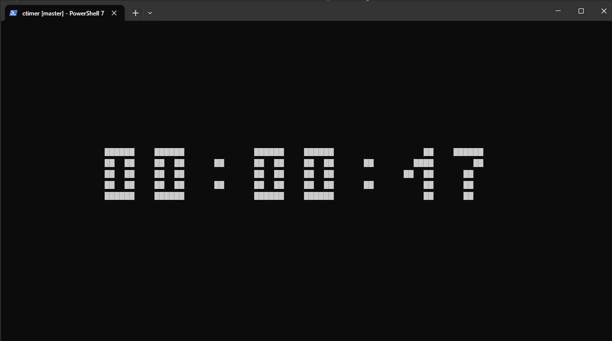

# CTimer

CTimer is a simple terminal-based timer application written in C. It can either display the current time or count down from a specified number of seconds. The time is displayed in a stylized format using ASCII art.



## Usage

To compile the project, you can use the provided `Makefile`. Simply run:

```sh
make
```

This will produce an executable named `ctimer`.

### Running the Timer

To display the current time:

```sh
./ctimer
```

To start a countdown timer from a specified number of seconds:

```sh
./ctimer <time>
```

For example, to start a countdown timer from 60 seconds:

```sh
./ctimer 60
```

### Command-line Arguments

- `<time>`: The number of seconds to count down from. If not provided, the current time will be displayed.

### Examples

Display the current time:

```sh
./ctimer
```

Start a countdown timer from 30 seconds:

```sh
./ctimer 30
```

## Customization

The appearance of the timer can be customized by modifying the symbols and colors used for the foreground and background. These can be set in the `style.h` file.

### style.h

```c
#define RESET "\033[0m"
#define RED "\033[31m"
#define GREEN "\033[32m"
#define YELLOW "\033[33m"
#define BLUE "\033[34m"
#define MAGENTA "\033[35m"
#define CYAN "\033[36m"
#define WHITE "\033[37m"

#define BG_SYM " "
#define BG_COLOR WHITE
#define FG_SYM "█"
#define FG_COLOR WHITE
```

## License

This project is licensed under the MIT License. See the LICENSE file for more details.
